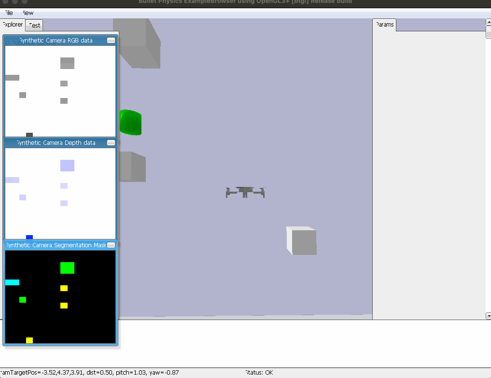
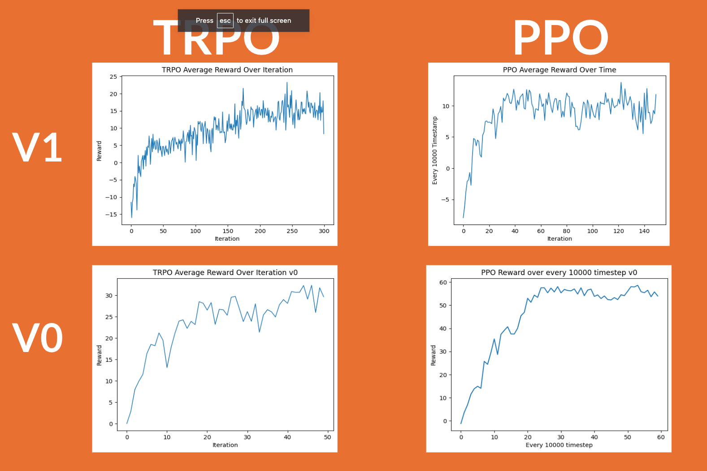

# Pybullet-Gym-Drone

Drone auto-navigation stimulation developed in [Pybullet](https://pybullet.org/) + [OpenAI Gym](https://github.com/openai/gym) Environment. Trust Region Policy Optimization (TRPO) and Proximal Policy Optimization (PPO) is implemented.

# Result
| Sucess Rate | DroneNavigationV0 |DroneNavigationV1   |
|-----------------|-----------------|-----------------|
| TRPO | 50.0% | 39.2% |
| PPO | 91.2% |11.2% |

# Installation

# Run

Thanks [Medium series on creating OpenAI Gym Environments with PyBullet](https://medium.com/@gerardmaggiolino/creating-openai-gym-environments-with-pybullet-part-1-13895a622b24). 
